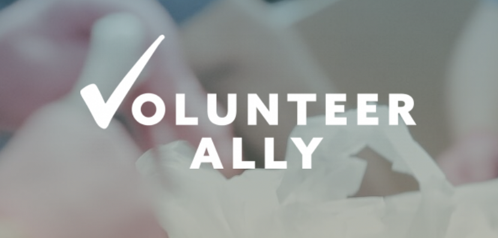
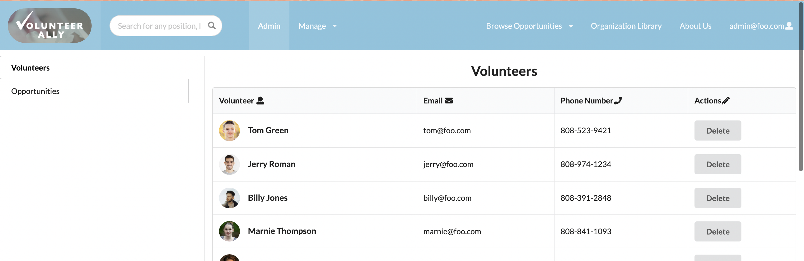
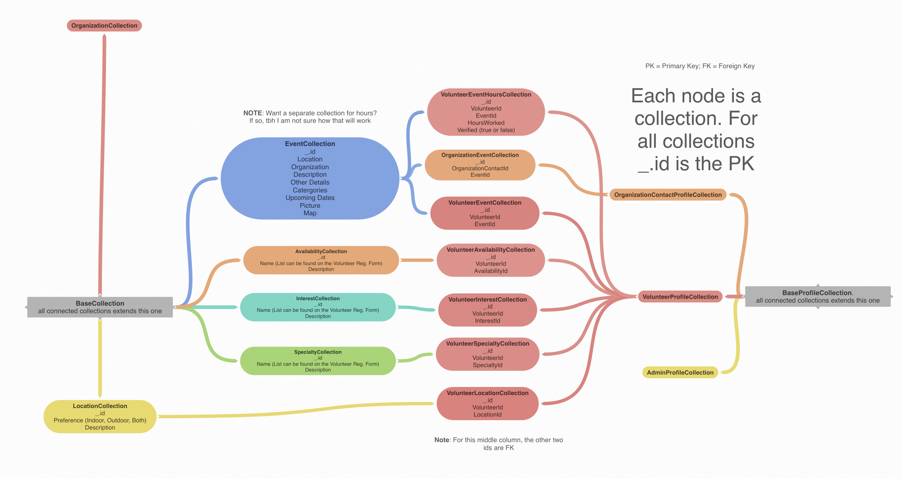

Software engineer II has brought a lot of new insight and knowledge for me regarding coding techniques. With the new version of the Meteor template to work off of, it felt like I was re-learning software engineering all over again. Everything was structured and organized differently, it was hard to implement things that I have previously done with the old template. However, at the end of the class I feel that I gained a lot of knowledge on adapting to new change and how to work with it. 

## Meeting Volunteer Ally

The main thing that got me excited for this class was the fact that we were able to work with a real client who was seeking our help. Being able to meet them (virtually) and see their website idea got me brainstorming a lot about different features we could implement and how to make it user-friendly. The point of the website was for people of all ages to be able to search for various volunteering opportunities throughout the island from different organizations and be able to sign up for them. This was an interesting idea and got me looking forward to working with my team to tackle this huge challenge. Each customer milestone got me and my team motivated to complete our redesign into something that they would be proud of. Hearing their feedback and compliments fueled us for our next meeting and helped us create an end goal for our milestones. 

## Redesigning Volunteer Ally 

For our mockup, we hard coded a lot of what they wanted the website to look like. Down to every last detail such as the headers, menu, footers, and event profiles. From the beginning I could see that this website was jam packed with a ton of features that would take a lot of time to implement. For example, the event profile has a lot of interactions that the user can do. There were buttons for social media sharing, a button to send an email to the organization, an interactive Google map that displayed where the event is taking place, and even a get directions button. I knew later down the road that implementing all of these would be a big challenge for us. There were also new features that the client wanted us to implement such as an admin dashboard and a way for organizers and admins to verify hours for volunteers. I was in charge of designing what the admin dashboard would look like and how we would go about verifying hours. After much brainstorming between the team, I came up with the idea of having separate tabs for volunteers and events for the admin to view. The individual events in the events tab will have a view button that would show all the volunteers that participated and the amount of default hours that the event lasted. The admin has an option to either check all of the volunteers off or edit a specific volunteer with the amount of hours they were there for. After submitting and verifying the hours, the admin is then able to export the table into a CSV file format for recording purposes. I had a lot of fun brainstorming different ways for admins to verify hours and how the dashboard would look because it gave me the freedom to let my creativity take advantage and design it to what I thought would be the most user-friendly method. 

## Challenges We Faced
There were a lot of challenges that me and the team had to overcome while completing this project. The biggest challenge we were faced with was creating the collection for each data category that was necessary for the site to work. Many pages of the website required a lot of data to be cross referenced and matched. For example, creating a volunteer profile would mean pulling up data from their user data as well as the events that the specific user has participated in and how many hours this user has participated. This required many collections to be created so that they could be easily matched with other collections and also be easy to search for specific data.

 Our team came up with a rough mock up on the sort of collections we needed to create and how they related to one another. This map was in the early stages of our planning but it definitely showed the amount of thought we put into making the website as efficient as possible. 
