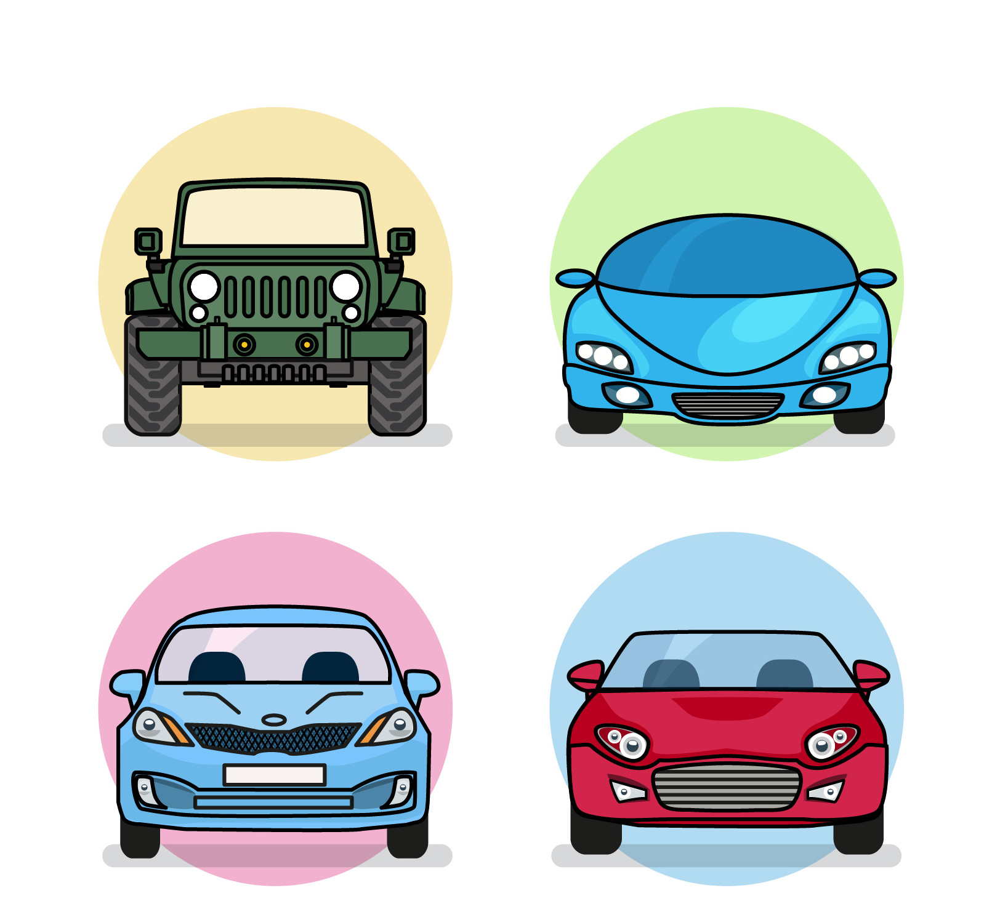

Humans always tend to find the most efficient way to get things done. Whether it’s getting from point A to point B or illuminating a room; we always try to find how to do it in a way that we don’t exert extra unnecessary work to achieve that goal. A lot of these typical tasks are shared by everyone; we all want to be able to travel to places as fast as possible, we all want to be able to have a source of light whenever it’s dark, and more. So why don’t we all come up with a common solution to these things that we can all share? 

That’s exactly what happened when Karl Benz invented the first automobile back in 1885 and Thomas Edison developed the first light bulb in 1879. 

